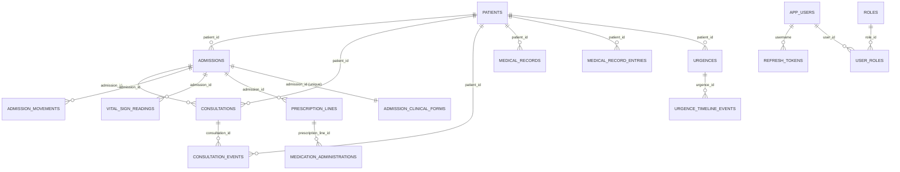

# Bilan du projet Afya Health System (backend)

Document de **retour d’expérience** et de **préparation au frontend** : ce qui a été mis en place côté API, comment cela se compare aux **fiches médicales papier** (Hôpital Jason Sendwe, etc.) partagées en référence, et **pistes d’évolution** prioritaires.

---

## 1. Périmètre rappel

- **Stack** : Spring Boot 3.3.5, Java 21, JPA, Oracle (dev) / H2 (tests), JWT, Flyway.
- **Architecture** : modules SOA sous `com.afya.afya_health_system.soa` (patient, identity, admission, consultation, medicalrecord, urgence, reporting, common).
- **API** : préfixe `/api/v1/`, messages d’erreur souvent en français côté métier.

### 1.1 Périmètre exclu ou reporté (décision actuelle)

| Sujet | Statut |
|--------|--------|
| **Frontend** | **En cours** : SPA **React + Vite** dans le dossier `frontend/` (auth JWT, liste / détail patients ; autres écrans à brancher). |
| **Finance** (prestations, facturation, caisse) | Hors cycle actuel. |
| **Laboratoire** (demandes / résultats) | **Reporté en fin de cycle** : à traiter après le reste des améliorations backend prévues, pas maintenant. |

**Priorité actuelle** : **interface web** (`frontend/`) en parallèle de la stabilisation ; **laboratoire** toujours **reporté** (§1.1). **Finance** hors cycle sauf décision contraire. Backend §4.2 cœur **déjà livré** côté API.

---

## 2. Travaux réalisés (synthèse)

### 2.1 Sécurité et identité

- **JWT** (access + refresh), filtre Bearer, plus d’utilisateur Spring **in-memory** généré : exclusion de `UserDetailsServiceAutoConfiguration` sur l’application principale.
- **Utilisateurs persistants** : tables `app_users`, `refresh_tokens` ; login, refresh avec **rotation** et **révocation** au logout.
- **Configuration** : secrets JWT via variables d’environnement (longueur minimale documentée dans le projet).

### 2.2 Données et qualité

- **Exceptions** centralisées dans `GlobalExceptionHandler` (incl. `ResponseStatusException` pour cohérence 401/JSON).
- **Transactions** sur les services métier principaux.
- **Cohérence métier** : vérification d’existence patient (et admission / patient pour les consultations) avant création.
- **Oracle** : types `CLOB` pour textes longs, `open-in-view=false` en dev, dialecte Oracle retiré du profil dev quand inutile.

### 2.3 Schéma Oracle et intégrité

- **Flyway** : migrations sous `src/main/resources/db/migration/oracle/`.
- **Clés étrangères** : script idempotent (V1/V2 selon historique) reliant admissions, consultations, événements, dossier médical, urgences, refresh tokens → `patients` / tables parentes.
- **Piège corrigé** : avec `baseline-on-migrate=true`, un schéma déjà rempli par Hibernate pouvait être **baseliné en version 1 sans exécuter le SQL** des FK — d’où passage à `baseline-on-migrate=false` en dev et migration **V2** pour ré-appliquer les contraintes si besoin.
- **Quota tablespace** : résolution ORA-01950 côté DBA (`ALTER USER … QUOTA … ON USERS`).

### 2.4 Documentation dans le code

- **JavaDoc** bilingue (anglais + paragraphe « Français : ») sur handlers, services métier, contrôleurs, sécurité.
- **Contrôleurs** formatés avec blocs multi-lignes homogènes.
- Fichiers **`.env.example`** et **`application-dev.properties`** commentés (Oracle, Flyway, JWT, bootstrap).

### 2.5 Outils

- **IntelliJ** : variables d’environnement typiques sur la run configuration Spring Boot (quand le dépôt versionne `.idea` — attention au `.gitignore` local).

### 2.6 Gestion des utilisateurs (admin)

- **Module livré (V1 + V2)** : gestion des comptes applicatifs via API admin et écran frontend `Utilisateurs`.
- **Sécurité d’accès** : toutes les routes `/api/v1/users/**` exigent le rôle `ROLE_ADMIN` (sinon `403`).
- **Cycle de vie compte** : création, modification, activation/désactivation, suppression.
- **Règles de protection** :
  - auto-suppression interdite ;
  - suppression du dernier administrateur actif interdite ;
  - désactivation du dernier administrateur actif interdite.
- **Effet sur l’authentification** : un compte désactivé ne peut pas se connecter (login/refresh/me refusés).

**Endpoints principaux**

| Méthode | Endpoint | Usage |
|--------|----------|-------|
| `GET` | `/api/v1/users?query=&page=&size=&sortBy=&sortDir=` | Liste paginée + recherche + tri |
| `POST` | `/api/v1/users` | Créer un utilisateur |
| `PUT` | `/api/v1/users/{id}` | Modifier nom, rôles, mot de passe (optionnel) |
| `PATCH` | `/api/v1/users/{id}/status` | Activer / désactiver |
| `DELETE` | `/api/v1/users/{id}` | Supprimer (avec garde-fous) |

**Tri autorisé (whitelist backend)** : `id`, `username`, `fullName`, `active`.

**Matrice des 4 rôles (version simple validée)**

| Utilisateur | Cas d’utilisation |
|-------------|-------------------|
| Admin | Gérer les utilisateurs ; gérer les services hospitaliers ; générer les activités du système |
| Réceptionniste | Enregistrer un patient ; gérer les admissions |
| Médecin | Prise en charge médicale |
| Infirmier(ère) | Enregistrer les soins |

**Version ultra simple (1 ligne par rôle)**

- **Admin** : gère la plateforme (comptes, rôles, contrôle global).
- **Réceptionniste** : enregistre les patients et gère les admissions.
- **Médecin** : prend en charge le patient médicalement (diagnostic, décisions cliniques).
- **Infirmier(ère)** : enregistre et suit les soins quotidiens (constantes, actes de soins).

**Checklist de validation manuelle (recette rapide)**

- [ ] **Accès admin** : un compte `ROLE_ADMIN` accède à l’écran `Utilisateurs` et aux appels API `/api/v1/users/**`.
- [ ] **Accès non admin refusé** : un compte sans `ROLE_ADMIN` reçoit `403` sur `/api/v1/users/**`.
- [ ] **Création utilisateur** : création OK avec `username` unique ; mot de passe haché ; compte actif par défaut.
- [ ] **Recherche / tri / pagination** : la liste répond correctement à `query`, `page`, `size`, `sortBy`, `sortDir`.
- [ ] **Modification profil** : mise à jour du nom et des rôles OK ; mot de passe changé uniquement si renseigné.
- [ ] **Désactivation protégée** : impossible de désactiver le dernier administrateur actif.
- [ ] **Suppression protégée** : impossible de s’auto-supprimer et impossible de supprimer le dernier administrateur actif.
- [ ] **Compte désactivé bloqué** : login/refresh/me refusés pour un utilisateur inactif.

### 2.7 Numérotation des dossiers patients

- **Règle métier** : le numéro de dossier est généré automatiquement au format `DOS-YYYY-AAAA-0001`.
- **Séquence** :
  - la partie numérique va de `0001` à `9999` ;
  - à `9999`, elle revient à `0001` et le bloc lettres s’incrémente (`AAAA` → `AAAB` → `AAAC` ...).
- **Portée** : la séquence est gérée **par année** (`YYYY`) et redémarre avec un nouveau compteur annuel.
- **Objectif** : garantir un ordre strict, lisible et non aléatoire pour l’identification administrative des patients.

---

## 3. Comparaison avec les fiches papier fournies

### 3.1 Ce que vous avez envoyé et comment cela a été utilisé

Les **photos / scans de fiches** que vous avez partagés (Hôpital public de référence tertiaire **Jason Sendwe**, Haut-Katanga) ont été **analysés comme référence métier**, pas comme fichiers techniques dans le dépôt Git : ils décrivent la **réalité opérationnelle** que le système doit progressivement refléter.

Voici la **correspondance document → lecture produit** :

| Document observé | Lecture pour Afya |
|--------------------|---------------------|
| **Fiche médicale** (en-tête institutionnel, N° dossier / N° admission, identité, employeur, famille, bloc hospitalisation service/lit/diagnostic/médecin, grande zone DATE + observations) | Confirme la séparation **dossier patient / séjour (admission)** et le besoin d’**historique chronologique** par journée de séjour ; la grille « une ligne par date » guide les écrans de **carnet de séjour / consultations**. |
| **Fiche de traitement** (service, médecin traitant, grille **médicament × colonnes de dates**, coches type matin/soir ; en bas constantes + courbe **T°** M/S) | **Réalisé (API)** : prescriptions + administrations date × créneau ; constantes structurées (§4.2). Manquent surtout **grille UI**, **courbe T°** graphique, **référentiel médicaments** → frontend / reporting / évolution produit. |
| **Fiche d’hospitalisation** (antécédents, anamnèse, examen par appareil, paraclinique, conclusion ; mentions type « sortie autorisée ») | **Réalisé (API)** : `AdmissionClinicalForm` (zones par section, §4.2). Clôture de séjour : **sortie / décès** via workflow **admission** ; pas d’export PDF ni maquette papier identique. |
| **Pages suivi médicaments / constantes** (diurèse, TA, pouls, poids, selles + graphique température) | Renforce la même exigence : **saisie paramétrique par jour / par créneau** pour rapprocher l’outil du carnet papier. |
| **Fiche comptable** (perceptions avec N° reçus ; tableau **date / prestation / coût**) | Pointe vers un futur **volet financier** : actes facturables et encaissements liés au patient ou à l’admission. |

Cette analyse alimente directement le **tableau comparatif** ci-dessous (écart entre papier et backend actuel) et la **section 4** (améliorations).

### 3.2 Écart entre les fiches et le backend actuel

| Élément papier | Équivalent actuel dans Afya (backend) | Écart / commentaire |
|----------------|----------------------------------------|----------------------|
| **N° dossier** | `patients.dossier_number` (+ id technique) | Aligné. |
| **N° admission** | `admissions.id` (une ligne par hospitalisation) | Aligné : nouvelle admission = nouveau séjour. |
| Identité, adresse, employeur, famille | `Patient` + contacts | **Réalisé** : post-nom, employeur, matricule, profession, conjoint (voir §4.2) ; adresse / téléphone / email comme avant. |
| Date entrée / sortie, service, lit | `admissions` + mouvements `admission_movements` | Aligné pour entrée/sortie/transfert ; lit/service sur l’en-tête d’admission. |
| **Grande zone DATE + notes** (évolution quotidienne) | `consultation_events` + éventuellement entrées dossier `PROBLEM`/`DOCUMENT` | Papier = **une ligne par jour** structurée visuellement ; numérique = **événements datés** sans grille « jour J » dédiée. |
| **Fiche de traitement** (médicaments × jours, coches matin/soir) | `prescription_lines` + `medication_administrations` par admission | **API** : lignes médicament + coches date × créneau ; pas de grille UI ni référentiel médicaments centralisé. |
| **Constantes** (TA, pouls, poids, diurèse, selles, courbe T°) | `VitalSignReading` par **admission** + créneau M/S/Journée | **API structurée** (§4.2) ; **pas** encore de courbe T° ni export graphique (frontend / reporting). |
| **Fiche d’hospitalisation** (antécédents, anamnèse, examen par organe) | `admission_clinical_forms` (zones texte par section) | **GET/PUT** `/api/v1/admissions/{id}/clinical-form` ; pas d’export PDF ni workflow papier identique. |
| **Fiche comptable** (perception, actes à facturer) | Module **reporting** factice (`N/A`) | **Non couvert** — facturation à concevoir. |

**Conclusion** : le backend couvre **l’ossature**, **l’identité administrative étendue**, **les constantes par admission**, **les lignes de prescription et coches d’administration**, et **le formulaire d’hospitalisation par sections texte** (voir §4.2 pour les endpoints). **Restent principalement** : présentation **UI** (grilles, PDF, courbes), **référentiel médicaments** optionnel, **comptabilité**, **laboratoire** (reporté §1.1), et **reporting** enrichi.

---

## 4. Améliorations proposées (priorisables)

### 4.1 Court terme (stabilité prod / DX)

- **Profils** : **réalisé** — `dev` = H2 (`application-dev.properties`) ; `oracle` = Oracle + Flyway (`application-oracle.properties`) ; défaut `SPRING_PROFILES_ACTIVE=dev` dans `application.properties`. Voir **`docs/FLYWAY_ET_PROFILS.md`**.
- **Flyway** : **réalisé** — même document (`docs/FLYWAY_ET_PROFILS.md`) décrit profils, premier boot, ORA-01950.
- **Tests d’intégration** : **réalisé** — claim `jti` sur les refresh JWT (unicité même seconde) ; admissions/urgences créent un patient avant les scénarios métier. `./mvnw test` doit passer.
- **OpenAPI** : **réalisé** (springdoc) — JSON `/v3/api-docs`, UI `http://localhost:8090/swagger-ui/index.html` ; schéma JWT « bearer-jwt » pour tester les routes protégées depuis Swagger.
- **Notification de création de compte** : **à venir** — envoi email/SMS avec lien d’activation ou OTP (jamais de mot de passe en clair dans le message).

### 4.2 Métier clinique (rapprochement des fiches)

- **Patient étendu** : **réalisé** — post-nom (`postName`), employeur, matricule (`employeeId`), profession, conjoint (`spouseName`, `spouseProfession`) ; recherche texte inclut le post-nom ; migration Oracle **`V3__patient_demographics_vital_signs.sql`** (colonnes patient).
- **Constantes** : **réalisé (API)** — entité `VitalSignReading` liée à `admission_id` ; TA (sys/dia), pouls, T°, poids, diurèse (ml), selles (texte), créneau `MATIN` / `SOIR` / `JOURNEE` ; endpoints `GET|POST /api/v1/admissions/{id}/vital-signs`. Table créée par Hibernate (tests/dev) et par Flyway V3 sur Oracle.
- **Module traitement / prescription** : **réalisé (API)** — `PrescriptionLine` + administrations (`POST` coches par date/créneau `MATIN`/`SOIR`/`JOURNEE`) sous `/api/v1/admissions/{id}/prescription-lines` ; migration Oracle **V4**. Référentiel médicaments centralisé : **non** (libellé libre).
- **Formulaire d’hospitalisation structuré** : **réalisé (API)** — `AdmissionClinicalForm` ; **GET/PUT** `/api/v1/admissions/{id}/clinical-form` ; migration **V4**.
- **Laboratoire** : demandes et résultats (même minimalistes) — **reporté en fin de travail** (voir §1.1).

### 4.3 Finance

- **Prestations** : lieux de saisie type fiche comptable (date, libellé, montant) liés patient/admission ; plus tard lien caisse / reçus.  
  → **Hors périmètre actuel** (§1.1).

### 4.4 Frontend

→ **En cours** (§1.1) : base **React + Vite** (`frontend/`), **CORS** configurable (`app.cors.allowed-origins` / `APP_CORS_ALLOWED_ORIGINS`). **Déjà** : connexion JWT, refresh token, **patients** (recherche paginée, fiche détail). **À venir** : admissions, constantes, prescriptions, grilles type fiches, PDF.

- Écrans par **parcours** : accueil patient → admission → consultation quotidienne → sortie/décès.
- Tableaux type **fiche de traitement** et **constantes** : composants grille date × paramètre.
- Auth : stockage refresh sécurisé, refresh automatique, gestion 401.
- **Accessibilité** et **impression PDF** alignées sur les modèles papier institutionnels si requis.

### 4.5 Diagramme relationnel (version courte)

Le schéma relationnel principal (FK actives relevées dans Oracle) peut être visualisé avec ce diagramme Mermaid synthétique :

---

## 5. Fichiers et zones utiles dans le dépôt

| Sujet | Emplacement indicatif |
|--------|------------------------|
| Exceptions HTTP | `soa/common/config/GlobalExceptionHandler.java` |
| Sécurité JWT | `soa/identity/config/SecurityConfig.java`, `JwtAuthenticationFilter.java` |
| Flyway Oracle | `src/main/resources/db/migration/oracle/` |
| Config dev | `src/main/resources/application-dev.properties` |
| Variables d’exemple | `.env.example` |
| Module admission (séjour, mouvements, **constantes**, **prescription**, **formulaire clinique**) | `soa/admission/` |
| Consultations | `soa/consultation/` |
| Dossier médical | `soa/medicalrecord/` |

---

## 6. Dernière phrase opérationnelle

Le **backend** expose déjà **§4.1** (profils, Flyway doc, tests, OpenAPI) et le **cœur §4.2** (patient étendu, constantes, prescription, formulaire clinique). **À traiter ensuite** selon les décisions : **laboratoire** (fin de cycle), puis **finance** et **frontend** lorsque le périmètre §1.1 sera élargi — ou du **polish** (référentiel médicaments, exports PDF, consolidation des exceptions / utilisateurs bootstrap).

---

*Document de bilan — à faire évoluer avec les décisions produit.*
