# II.4 Phase d’analyse et de conception — Diagrammes (Afya Health System)

Ce document supporte la rédaction du mémoire (**Figure ANALYSE ET CONCEPTION DU SYSTÈME.16** et suivantes). Il regroupe les diagrammes **Mermaid** à rendre via [Mermaid Live Editor](https://mermaid.live), Typora, VS Code (extension Mermaid) ou export SVG.

---

## II.4 Phase d’analyse

### II.4.1 Modèle du domaine

En génie logiciel, un **modèle de domaine** est une représentation simplifiée de certains éléments d’un domaine de connaissances ou d’activités. Ce modèle aide à résoudre des problèmes spécifiques à ce domaine. Il inclut les concepts importants du monde réel : données pertinentes pour l’activité et règles associées.

Le modèle utilise le **vocabulaire métier** pour faciliter l’échange avec les acteurs non techniques. Les besoins se déclinent souvent en **modèle conceptuel / logique des données**, puis en **modèle physique** (tables Oracle ou H2, migrations Flyway selon le profil).

#### Schéma conceptuel des données (MCD — `erDiagram`)

Vue **entités–associations** : cardinalités alignées sur le code ; le séjour référence une unité du catalogue par **`serviceName`** (chaîne égale au **nom** d’un `HospitalService`). Les utilisateurs métier ont un périmètre via la table **`user_hospital_services`**.

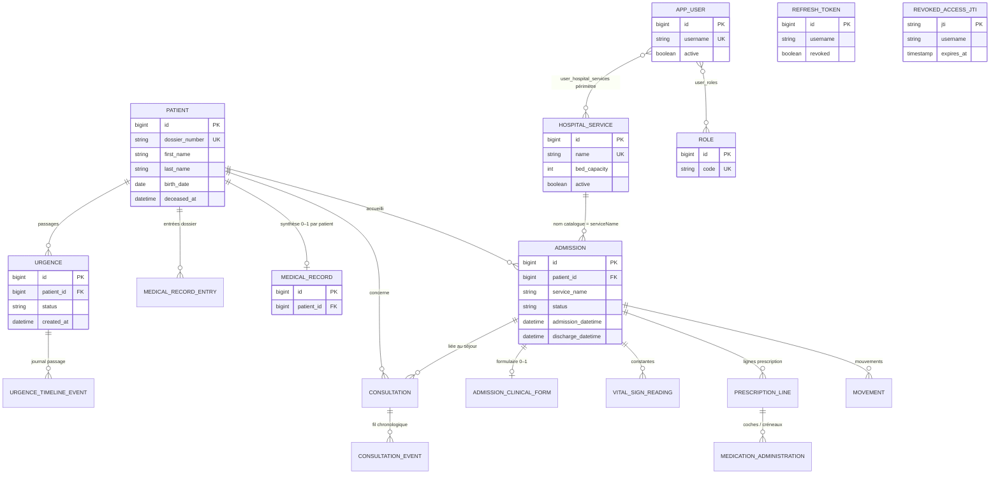

*Remarques : (1) génération du numéro de dossier (`patients.dossier_number`) s’appuie sur une table technique **`patient_dossier_sequences`** (compteur par année, **sans lien JPA direct** avec `Patient`) ; (2) les entités **`REFRESH_TOKEN`** et **`REVOKED_ACCESS_JTI`** sont reliées aux comptes par **`username`** (pas de clé étrangère numérique vers `APP_USER`).*

#### Schéma conceptuel — `classDiagram`

Équivalent UML (`classDiagram` Mermaid) du MCD ci-dessus : **attributs résumés** + **associations**.

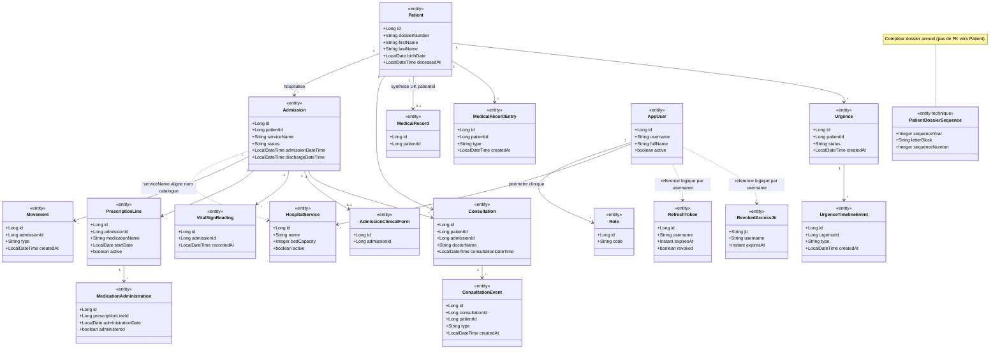

---

**Figure — Le modèle du domaine** : (1) associations métier ; (2)–(3) **attributs** alignés sur les entités JPA du dépôt.

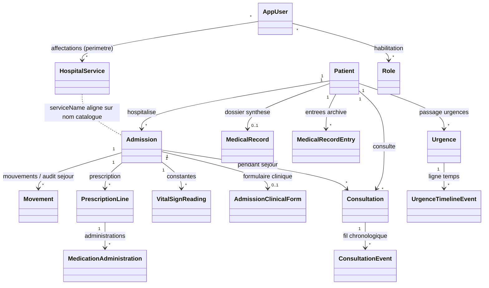

**Attributs — patient, catalogue, séjour hospitalier et aide à la décision clinique par admission**  
(Noms et types alignés sur les entités JPA du dépôt : `Patient`, `HospitalService`, `Admission`, `Movement`, `PrescriptionLine`, `VitalSignReading`, `MedicationAdministration`, `AdmissionClinicalForm`.)

```mermaid
classDiagram
  direction TB

  class Patient {
    <<entity>>
    +Long id
    +String firstName
    +String lastName
    +String dossierNumber
    +LocalDate birthDate
    +String sex
    +String phone
    +String email
    +String address
    +String postName
    +String employer
    +String employeeId
    +String profession
    +String spouseName
    +String spouseProfession
    +LocalDateTime deceasedAt
  }

  class HospitalService {
    <<entity>>
    +Long id
    +String name
    +Integer bedCapacity
    +boolean active
  }

  class Admission {
    <<entity>>
    +Long id
    +Long patientId
    +String serviceName
    +String room
    +String bed
    +String reason
    +LocalDateTime admissionDateTime
    +LocalDateTime dischargeDateTime
    +AdmissionStatus status
  }

  class Movement {
    <<entity>>
    +Long id
    +Long admissionId
    +String type
    +String fromService
    +String toService
    +LocalDateTime createdAt
    +String note
  }

  class PrescriptionLine {
    <<entity>>
    +Long id
    +Long admissionId
    +String medicationName
    +String dosageText
    +String frequencyText
    +String instructionsText
    +String prescriberName
    +LocalDate startDate
    +LocalDate endDate
    +boolean active
    +LocalDateTime createdAt
  }

  class VitalSignReading {
    <<entity>>
    +Long id
    +Long admissionId
    +LocalDateTime recordedAt
    +VitalSignSlot slot
    +Integer systolicBp
    +Integer diastolicBp
    +Integer pulseBpm
    +BigDecimal temperatureCelsius
    +BigDecimal weightKg
    +Integer diuresisMl
    +String stoolsNote
  }

  class MedicationAdministration {
    <<entity>>
    +Long id
    +Long prescriptionLineId
    +LocalDate administrationDate
    +VitalSignSlot slot
    +boolean administered
  }

  class AdmissionClinicalForm {
    <<entity>>
    +Long id
    +Long admissionId
    +String antecedentsText
    +String anamnesisText
    +String physicalExamPulmonaryText
    +String physicalExamCardiacText
    +String physicalExamAbdominalText
    +String physicalExamNeurologicalText
    +String physicalExamMiscText
    +String paraclinicalText
    +String conclusionText
  }
```

**Attributs — consultation chronologique, dossier médical, urgences, identité et jetons**  
(Même référentiel que le code : `Consultation`, `ConsultationEvent`, `MedicalRecord`, `MedicalRecordEntry`, `Urgence`, `UrgenceTimelineEvent`, `AppUser`, `Role`, `RefreshToken`, `RevokedAccessJti`.)

```mermaid
classDiagram
  direction TB

  class Consultation {
    <<entity>>
    +Long id
    +Long patientId
    +Long admissionId
    +String doctorName
    +String reason
    +LocalDateTime consultationDateTime
  }

  class ConsultationEvent {
    <<entity>>
    +Long id
    +Long consultationId
    +Long patientId
    +String type
    +String content
    +LocalDateTime createdAt
  }

  class MedicalRecord {
    <<entity>>
    +Long id
    +Long patientId
    +String allergies
    +String antecedents
    +LocalDateTime createdAt
    +LocalDateTime updatedAt
  }

  class MedicalRecordEntry {
    <<entity>>
    +Long id
    +Long patientId
    +String type
    +String content
    +LocalDateTime createdAt
  }

  class Urgence {
    <<entity>>
    +Long id
    +Long patientId
    +String motif
    +String priority
    +String triageLevel
    +String orientation
    +UrgenceStatus status
    +LocalDateTime createdAt
    +LocalDateTime closedAt
  }

  class UrgenceTimelineEvent {
    <<entity>>
    +Long id
    +Long urgenceId
    +String type
    +String details
    +LocalDateTime createdAt
  }

  class AppUser {
    <<entity>>
    +Long id
    +String username
    +String email
    +String fullName
    +String passwordHash
    +boolean active
    +int failedLoginAttempts
    +Instant lockedUntil
    note for AppUser "Associations JPA persistées :\nroles (user_roles),\nhospitalServices (user_hospital_services)"
  }

  class Role {
    <<entity>>
    +Long id
    +String code
    +String label
  }

  class RefreshToken {
    <<entity>>
    +Long id
    +String token
    +String username
    +Instant expiresAt
    +boolean revoked
  }

  class RevokedAccessJti {
    <<entity>>
    +String jti
    +Instant expiresAt
    +String username
  }
```

> **PatientDossierSequence** (attribu technique de numérotation : `sequenceYear`, `letterBlock`, `sequenceNumber`) n’apparaît pas sur le premier diagramme mais complète la couche patient côté persistance.

*Remarque métier : le contrôle d’accès « urgences » et le filtrage des admissions s’appuient sur les **noms** des services du catalogue (`HospitalService`) affectés à l’utilisateur (`AppUser`).*

---

### II.4.2 Diagramme des classes participantes

Le diagramme des classes participantes relie les **cas d’utilisation** au **modèle de domaine**. Il s’appuie sur un **découpage en couches** et distingue trois types de classes d’analyse :

| Type | Rôle |
|------|------|
| **Classe de dialogue** (`<<boundary>>`) | Interaction utilisateur : interface web ou point d’entrée REST. |
| **Classe de contrôle** (`<<control>>`) | Coordination des traitements : services applicatifs, accès données via repositories. |
| **Classe d’entité** (`<<entity>>`) | Données métier persistantes et règles de structure associées. |

Les figures suivantes couvrent les cas **a à g** demandés, plus **h) Gérer les urgences** et **S’authentifier** (transversal).

| Cas | Intitulé (analyse) |
|-----|---------------------|
| **a** | Gérer les utilisateurs |
| **b** | Gérer les services hospitaliers |
| **c** | Générer les activités du système *(rapports / agrégats sur les mouvements et le journal des urgences)* |
| **d** | Enregistrer un patient *(cf. CRUD / recherche dans l’implémentation)* |
| **e** | Gérer les admissions |
| **f** | Prise en charge médicale |
| **g** | Enregistrer les soins *(constantes vitales, administrations)* |

#### a) Gérer les utilisateurs

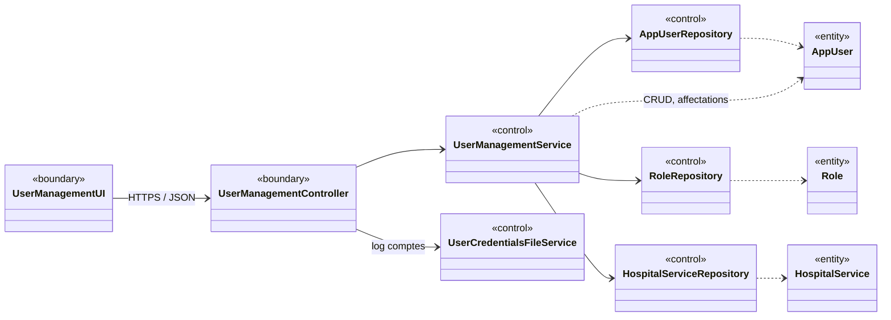

#### b) Gérer les services hospitaliers

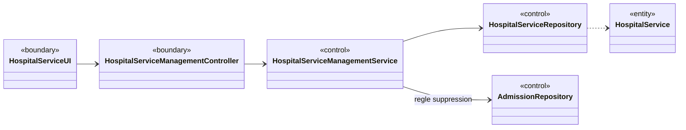

#### c) Générer les activités du système (rapports, statistiques)

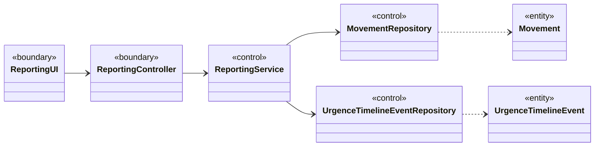

#### d) Enregistrer un patient

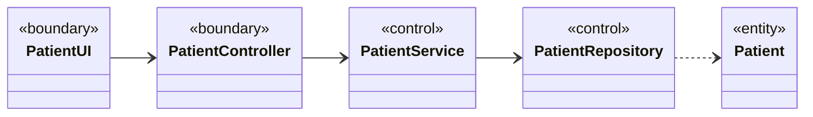

#### e) Gérer les admissions

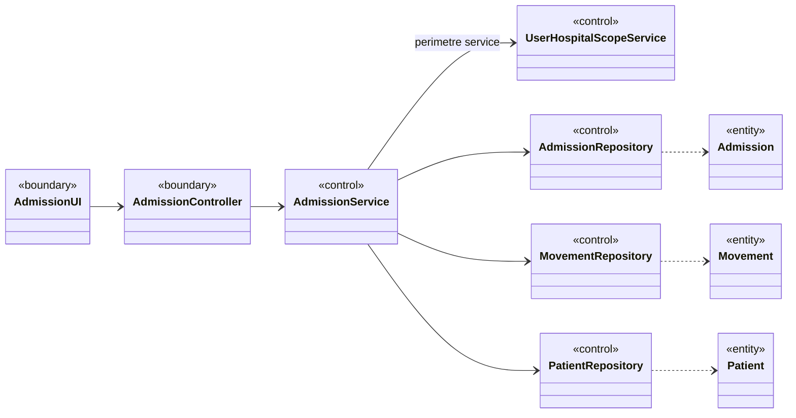

#### f) Prise en charge médicale

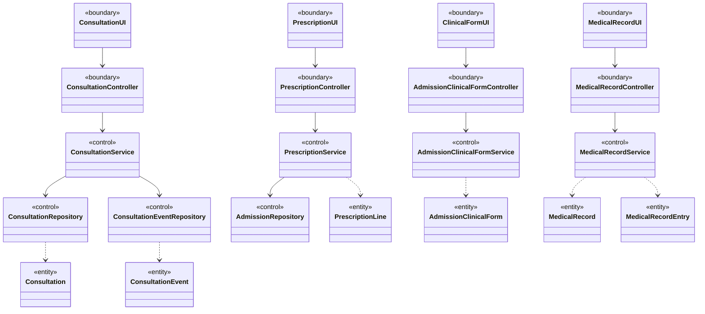

#### g) Enregistrer les soins

*(Constantes vitales et administrations médicamenteuses liées au séjour.)*

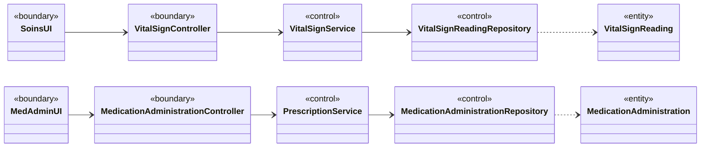

#### h) Gérer les urgences

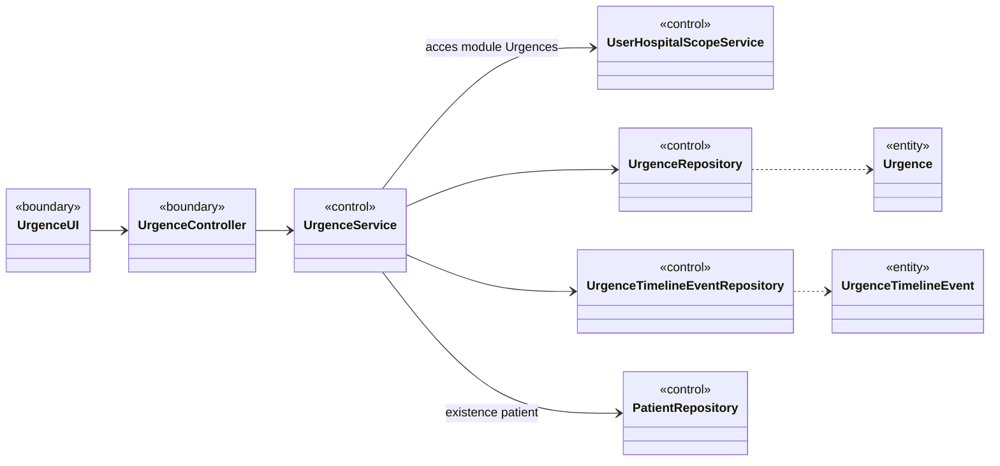

#### Transversal — S’authentifier

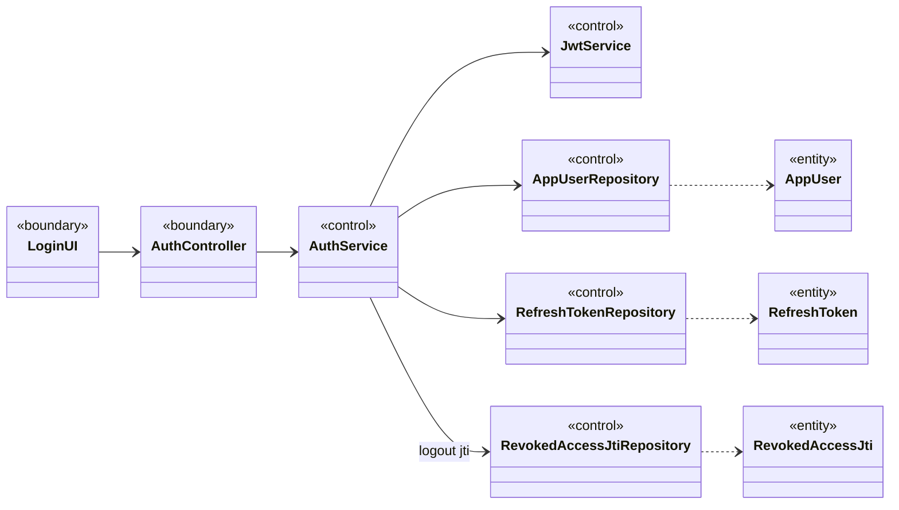

---

### II.4.3 Diagramme d’activités

Vue générique **couloirs Utilisateur / Système** (navigation, validation, persistance).

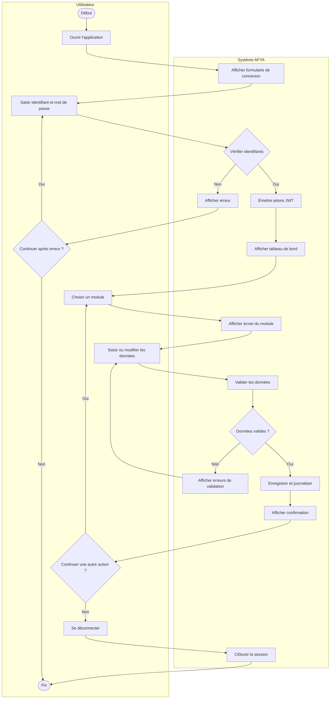

---

### II.4.4 Diagramme de conception

Le diagramme de conception présente l’**organisation technique** : **séparation par couches** (contrôleur, service, dépôt, modèle) et **répartition modulaire** (modules SOA).

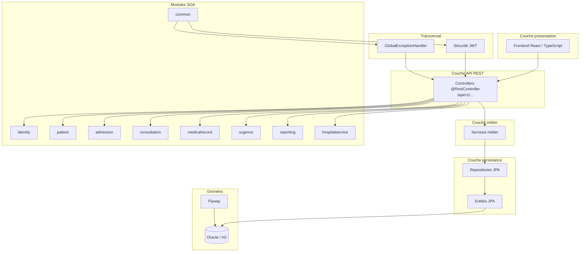

---

## Légende (mémoire)

| Stéréotype UML | Équivalent analyse |
|----------------|-------------------|
| `<<boundary>>` | Classe de **dialogue** (UI ou façade REST) |
| `<<control>>` | Classe de **contrôle** (service, repository applicatif) |
| `<<entity>>` | Classe d’**entité** (données métier persistées) |

---

*Projet Afya Health System — figures à numéroter selon votre convention (ex. II.16 modèle domaine, II.17 classes participantes, II.18 activités, II.19 conception).*
